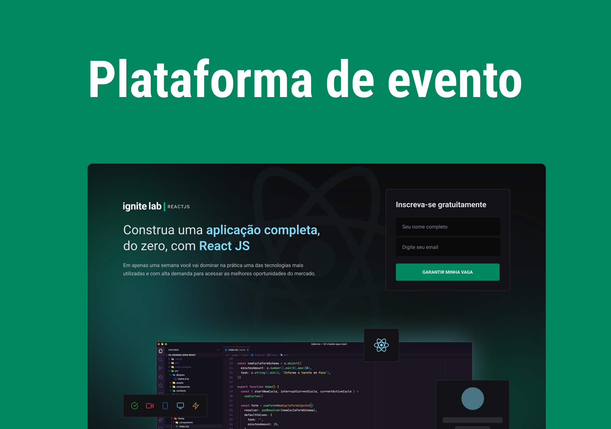

<h1 align="center">
  
</h1>

<h1 align="center">
  
</h1>

# Sobre o projeto

<p>
Projeto desenvolvido durante o evento Ignite Lab da Rocketseat.
</p>

# Tecnologias

- [Vite](https://vitejs.dev/)
- [ReactJs](https://reactjs.org/)
- [TypeScript](https://www.typescriptlang.org/)
- [Phosphor React](https://github.com/phosphor-icons/phosphor-react)
- [TailwindCSS](https://tailwindcss.com/)
- [GraphQL](https://graphql.org/)
- [Graph CMS](https://graphcms.com/)
- [GraphQL Code Generator](https://www.graphql-code-generator.com/)
- [Apollo Client](https://www.apollographql.com/docs/react/)
- [Date-fns](https://date-fns.org/)
- [VimeJs](https://vimejs.com/)

## Como baixar o projeto

```bash
# Clonar o repositório
$ git clone https://github.com/wellingtonrodriguesbr/ignitelab-02.git

# Entrar no diretório
$ cd ignitelab-02


# Instalar as dependências
$ npm install

# Rodar o projeto
$ npm run dev
```

<br/>
<hr/>

<p align="center">Desenvolvido por <a href="https://www.linkedin.com/in/wellingtonrodriguesbr/" target="_blank">Wellington Rodrigues</a> ✌🏽</p>